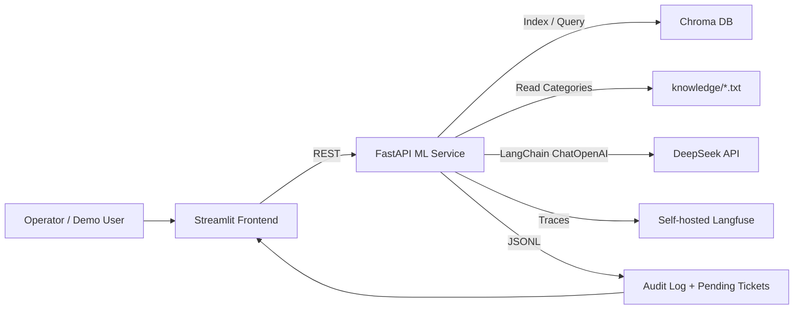

# Architecture

Синхронный путь PoC: frontend отправляет тикет в ML-сервис, сервис нормализует текст,
маскирует PII, классифицирует обращение через DeepSeek, ищет контекст в Chroma и
генерирует ответ только по найденным источникам.

Chroma хранит базу знаний. Тикеты и audit log в PoC пишутся в JSONL, потому что это
прозрачно для проверки. Если классификация требует оператора или context retrieval пустой,
тикет попадает в pending moderation.
