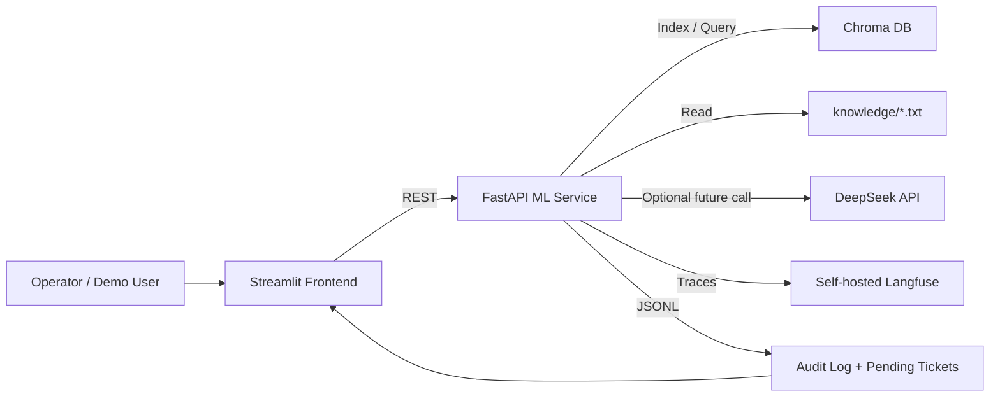

# Architecture

Синхронный путь PoC: frontend отправляет тикет в ML-сервис, ML-сервис классифицирует обращение правилами, оценивает риск, ищет контекст в Chroma и возвращает draft или решение `needs_human_review`.

Асинхронная production-часть в PoC не реализована. В целевой системе генерация ответа, дедупликация инцидентов и расширенная аналитика могут уйти в очередь, чтобы быстрый путь классификации и маршрутизации оставался в пределах 500 мс.

Chroma хранит только базу знаний. Тикеты и audit log в PoC пишутся в JSONL, потому что это быстрее и прозрачнее для проверки. Langfuse поднимается self-hosted на `localhost:3000` и используется для traces, когда пользователь добавит credentials в `.env`.
