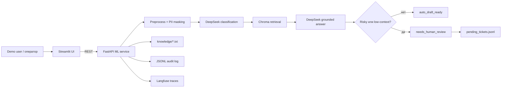

# Архитектура

## Компоненты

- `Streamlit UI`: demo-интерфейс для переиндексации базы знаний, отправки тикета и просмотра pending moderation.
- `FastAPI ML service`: endpoints `/health`, `/knowledge/reindex`, `/knowledge/inspect`, `/tickets/process`, `/tickets/pending`, `/tickets/{ticket_id}/moderate`.
- `TicketPipeline`: нормализация, PII masking, классификация, retrieval, генерация ответа, audit log.
- `Chroma`: локальное векторное хранилище для chunks из `knowledge/*.txt`.
- `DeepSeek`: текущий LLM для классификации и генерации ответа; `temperature=0`.
- `JsonlStore`: `audit_log.jsonl` и `pending_tickets.jsonl`.
- `Langfuse`: optional tracing; без ключей PoC работает без трассировки.

## Поток данных

1. Пользователь отправляет тикет в Streamlit или напрямую в `/tickets/process`.
2. Сервис нормализует текст и маскирует email, phone и card-like номера.
3. Классификатор возвращает Pydantic-схему: `category`, `requires_human_review`.
4. Retrieval ищет до `top_k=3` фрагментов в Chroma по `category + redacted_text`.
5. Генератор готовит короткий ответ только на основе найденного контекста.
6. Сервис пишет audit event; если нужен оператор, тикет попадает в pending moderation.
7. Решение возвращается как `TicketResponse` с `decision`: `auto_draft_ready` или `needs_human_review`.

## Sync и async

В PoC внешние HTTP endpoints реализованы как асинхронные: обработка тикета, reindex базы знаний, просмотр pending-тикетов и модерация вызываются через async def. Асинхронные контракты также добавлены для LLM-классификации, генерации ответа, retrieval из Chroma, индексации базы знаний и записи audit/pending событий.

При этом часть используемых библиотек и операций остается синхронной: Chroma/LangChain-вызовы, файловая запись JSONL и fallback-вызовы клиентов без ainvoke. Чтобы такие blocking-операции не блокировали event loop напрямую, они обернуты через asyncio.to_thread.

Бизнес-пайплайн в PoC остается линейным: preprocess -> classify -> retrieve -> answer -> log. Production queue, rate limiting и отдельный fast path до 500 мс не реализованы. В целевой архитектуре быстрая классификация и маршрутизация должны быть отделены от медленной LLM-генерации и долгой индексации базы знаний.

## Хранилища и интеграции

Chroma хранит индекс базы знаний. `knowledge/*.txt` является локальным источником доменов: `auth`, `feedback`, `legal`, `payments`; дополнительно есть `general` и `unknown`. JSONL используется для прозрачного audit log и списка pending tickets. В production JSONL заменяется на устойчивое event-хранилище и очередь модерации.

Chroma хранит векторизирвоанные представления *txt базы знаний, а Postgre хранит тикеты

## Human-in-the-loop и fallback

Human review обязателен для legal, спорных payments, account takeover, privacy-запросов, `unknown`, low-context и ошибок LLM. Если LLM недоступен, классификация деградирует в fallback по правилам/ключевым словам, а ответ не выдумывает факты. Если Chroma не нашла контекст, тикет получает `needs_human_review`.

## PoC и целевая архитектура

| Область | PoC | Целевая архитектура |
| --- | --- | --- |
| Нагрузка | один линейный pipeline | отдельный fast classification path и async generation |
| Очереди | В PoC не реализовано | очередь для пиков и slow LLM tasks |
| Хранилище решений | JSONL | event log/Postgres или аналогичное audit-хранилище |
| Embeddings | deterministic hash embeddings | проверенные multilingual embeddings, например E5 |
| Модерация | pending JSONL + endpoint approve/reject | рабочее место оператора и SLA-очередь |
| Наблюдаемость | optional Langfuse traces | traces + метрики + алерты + cost monitoring |
